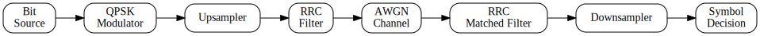

# qpsk-transceiver

QPSK (Quadrature Phase Shift Keying) transceiver simulation built on top of the
[QAMpy](https://github.com/ChalmersPhotonicsLab/QAMpy) project. The QAMpy code
is included as a Git submodule and supplies the foundational DSP building
blocks. This repository adds transceiver glue code, demos, tests, and documentation
infrastructure that showcase how to construct a complete QPSK transmission
chain.



The transceiver passes through the following stages:

- **Bit source** – generates the data to transmit.
- **QPSK modulator** – maps bits to complex symbols ([`qpsk_constellation.py`](demos/qpsk_constellation.py)).
- **Upsampler** – increases the sample rate ([`qpsk_rrc_upsample_eye.py`](demos/qpsk_rrc_upsample_eye.py)).
- **RRC filter** – shapes the signal ([`qpsk_rrc_upsample_eye.py`](demos/qpsk_rrc_upsample_eye.py)).
- **AWGN channel** – models additive noise ([`qpsk_constellation_awgn.py`](demos/qpsk_constellation_awgn.py), [`qpsk_ber_snr_sweep.py`](demos/qpsk_ber_snr_sweep.py)).
- **RRC matched filter** – filters the received signal ([`qpsk_rrc_upsample_eye.py`](demos/qpsk_rrc_upsample_eye.py)).
- **Downsampler** – reduces the sample rate before symbol decisions.
- **Symbol decision** – makes hard decisions and computes BER ([`qpsk_ber_snr_sweep.py`](demos/qpsk_ber_snr_sweep.py)).

One of the goals of this project is to test code development workflows using agentic AI.

## Installation

### Prerequisites

- Python 3.11
- [Git](https://git-scm.com/) with submodule support
- `numpy`, `scipy`, and `matplotlib`

### Setup

```bash
git clone --recurse-submodules <repo_url>
cd qpsk-transceiver
python -m venv .venv
# Activate the virtual environment (Unix/macOS)
source .venv/bin/activate
# Activate the virtual environment (Windows)
.\.venv\Scripts\activate
pip install -r requirements.txt -c constraints.txt
```

The commands above create an isolated Python environment and install the
packages required by the project using the pinned versions defined in
`requirements.txt` and `constraints.txt`.

If you cloned without `--recurse-submodules`, initialize the submodule using

```bash
git submodule update --init --recursive
```

## Running demos and tests
Demo scripts can be executed directly with Python:

```bash
python demos/<demo_script>.py

# Example
python demos/qpsk_constellation.py
```

Available demos:

| Script | Purpose |
| --- | --- |
| [qpsk_constellation.py](demos/qpsk_constellation.py) | Generate and plot a QPSK constellation. |
| [qpsk_constellation_awgn.py](demos/qpsk_constellation_awgn.py) | Add AWGN to a QPSK signal and compare constellations. |
| [qpsk_rrc_upsample_eye.py](demos/qpsk_rrc_upsample_eye.py) | Upsample with an RRC filter and display the eye diagram. |
| [qpsk_ber_snr_sweep.py](demos/qpsk_ber_snr_sweep.py) | Sweep SNR and plot simulated vs. theoretical BER. |

Run tests with `pytest`, treating warnings as errors:

```bash
python -W error -m pytest tests
```

## Documentation

[Online Documentation](https://juan9793.github.io/qpsk-transceiver/)

Generate API documentation with [Doxygen](https://www.doxygen.nl/). Graphviz is
required for diagram generation. Doxygen parses standard Python docstrings
directly, so no special comment syntax or extra dependencies are needed.

Install the tools:

- **Debian/Ubuntu:** `sudo apt-get install doxygen graphviz`
- **Windows:** download the installers from the [Doxygen](https://www.doxygen.nl/download.html) and [Graphviz](https://graphviz.org/download/) websites and ensure `doxygen` and `dot` are available in your `PATH`

Then build the docs:

```bash
cd documentation
doxygen Doxyfile
```

Open `documentation/build/html/index.html` in a web browser to view the
generated documentation. The docs workflow publishes to GitHub Pages; ensure the
repository's Pages **Source** is set to *GitHub Actions* so default branch
deployments do not overwrite the generated site.

## Contributing

Contributions are welcome through pull requests. Please follow the workflow and
role definitions in [AGENTS.md](AGENTS.md). Key points:

- Adhere to PEP-8 and include standard Python docstrings for new modules.
- Update or add tests for any new functionality.
- Ensure all tests pass without warnings before submitting a PR.
- Avoid adding new dependencies unless absolutely necessary and discuss them in the PR.

## Directory Structure

```
.
├─ AGENTS.md
├─ README.md
├─ base/
├─ constraints.txt
├─ demos/
├─ documentation/
│  ├─ Doxyfile
│  ├─ README.md
│  └─ diagrams/
├─ helpers/
├─ pytest.ini
├─ requirements.txt
└─ tests/
```

- `base/` – core transceiver implementation (includes the `QAMpy` submodule).
- `constraints.txt` – pinned versions for dependencies.
- `demos/` – example scripts and notebooks.
- `documentation/` – project documentation and diagrams.
- `helpers/` – utility functions shared across the project.
- `pytest.ini` – Pytest configuration suppressing QAMpy deprecation warnings.
- `requirements.txt` – project dependencies.
- `tests/` – test suite.


